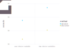

# StructuralDDP.jl

[![][docs-dev-img]][docs-dev-url]

This package defines, solves and simulates discrete dynamic optimization problems with fast value function iteration. It provides a simple and intuitive interface for working with [Markov decision processes (MDPs)](https://en.wikipedia.org/wiki/Markov_decision_process). It is similar to [POMDPs.jl](https://github.com/JuliaPOMDP/POMDPs.jl), but features different options to add structure to the problem and provide information about its properties. This way, a wide range of problems can be solved faster, without requiring parallelization.

It can be used in many disciplines, including robotics, automatic control, economics and manufacturing, or any problem that requires optimization of dynamic decision processes.

The package also allows problems to be defined using their mathematical formulation with minimal additional coding. There is no need to calculate any matrices for example. One only has to provide a reward function, a transition function, as well as state and action spaces.

The following figure compares the speed of standard solution methods (value function iteration using a state-action representation) with the structured approach for solving a capital investment model with one or two types of capital.

In the structured approach we specified that only some of the state variables should be integrated when calculating expectations, that the optimal choices are monotone in some of the states and that the value function is concave in some of the states and finally that part of the reward matrix should be pre-built before calling the solver.

[docs-dev-img]: https://img.shields.io/badge/docs-dev-blue.svg
[docs-dev-url]: https://pascalgolec.github.io/StructuralDDP.jl/dev
