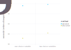

# DiscreteDynamicProgramming

This package solves and simulates discrete dynamic choice models with value function iteration fast. By taking advantage of properties of the problem, a wide array of problems can be solved very fast without requiring parallelization.

The following figure shows the time time to solve a model with one choice varaible (neoclassical) and two choice variables (intangibles) when using the acceleration methods in the toolbox versus not.

# To Do

- [ ] streamline model constructor. Put myself into shoes of user, try to create a model. End user shouldn't have to deal with types
- [ ] get rid of DDM, use DDP
- [ ] change name of grossprofits to rewardfunc_partial or something
- [ ] make tChoiceVectors optional (only if use SA)
    - in the problem constructor, make optional
    - remove it in separable and intermediate solver functions and other functions
    - change name of bEndogStatevars, to choicevars
- [ ] write documentation
- [ ] implement plotrecipe
- [ ] think about whether should include accountingvars() into this package
- [ ] :F is when the reward function has discontinuities
    - do later when design is fixed, because it may depend on it..
- [ ] firm exit

## Solver/simulator
- [ ] have :F in the solver for fixed adjustment costs
	- what is the generalization of fixed adjustment costs?
- [ ] make grid for K variable?
	- simulate with small grid, then tighten the grid
- [ ] Check ApproxFun.jl, whether can use algorhythm for any function approximation type (not just linear, but also Chebychev, Polynomial etc)
	- at the moment the solver does not interpolate, the simulator uses linear interpolation

## Models
- [ ] index state variables as dict instead of position (`tStateVector[:K]` instead of `tStateVector[1]`)
	- http://www.stochasticlifestyle.com/zero-cost-abstractions-in-julia-indexing-vectors-by-name-with-labelledarrays/
	- in value/policy function output, will have to find a good way to index then...
- [ ] calculate steady state for Intangibles model
- [ ] create model by supplying symbol always
- [ ] make sure solvers give the same answer for learning model
- [ ] include abilitmaimaiy to copy a model instance and change some parameters

## Concerning releasing it

- [ ] Ask people in the department if package could be useful, what kind of model they would like to see preprogrammed there
- [ ] Could libraries be called DiscreteDynamicModels, DiscreteDynamicEconomicModelsLibrary, SMM?
	- The DiscreteDynamicModels and Library is similar to QuantEcon actually, but with faster solvers and real-world economic models
		- need to provide reward function, transition function
	- Differentialequations has solvers and library separated, could emulate that
- probably good to have a post on my blog, explaining how to do it with a real world case
- Plot recipe so that people can plot the solution (check DiffEq.jl)
- DiscreteDynamicModels
- Check ApproxFun.jl, whether can use algorhythm for any function approximation type (not just linear, but also Chebychev, Polynomial etc)
- The NY Fed created DSGE.jl, lots of people use it
- For deprecating leadslagsffe: could look at TimeSeries.jl, although it is orthogonal to DataFrames.jl. They are not merged yet.
